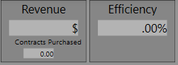

An important characteristic of the Rancor microworld is the gamification concept that is embedded into the system. You can see these aspects in the interface shown below. The original incarnation of the Rancor microworld was tested and validated using university students in psychology. Therefore there was a need for a compelling reason to be engaged in navigating procedures and a nuclear reactor. Shown below is a set of the gamification instructions that were used for previous studies and may be useful for your information.

**Table of Contents**

[Nuclear Power Overview](#Nuclear-Power-Overview)

[Interface](#Interface)

[Primary Loop (Orange)](#Primary-Loop-(Orange))

[Steam Generators](#Steam-Generators)

[Turbine and Valves](#Turbine-and-Valves)

[Bypass Valve](#Bypass-Valve)

[Alarms](#Alarms)

[Power, Efficiency, and Total Revenue](#Power,-Efficiency,-and-Total-Revenue)

[The Goal](#The-Goal)

[Tips and Tricks](#Tips-and-Tricks)

***
## Nuclear Power Overview

This image depicts the general organization of components for a nuclear power plant.

In general the plant can be divided into two main regions, which are the primary and secondary loops. The primary loop contains radioactive water, or coolant, and the secondary contains both water and steam. For safety, the coolant in the primary and water in the secondary never mix to prevent radioactive material from escaping.

On the left of the primary loop is the reactor core. The reactor is a large tank that uses a nuclear reactions occurring within fuel rods to heat the coolant. The amount reactivity, and in turn heat produced, is controlled by raising or lowering the rods. Raising the rods increases reactivity which in turn raises the temperature of the coolant.

The water exists the core through piping, referred to as the hotleg, and flows into the steam generator. The coolant flows through a heat exchanged within the steam generator to transfer its heat to the water in the secondary loop. As its name implies, the steam generator uses the heat from the coolant to turn water into steam. The radioactive coolant in the primary loop never mixes with the water in the secondary loop, but the heat from the coolant is transferred to the water to turn it into steam. After the coolant gives it heat to the water in the steam generators its temperature is reduced and it is pumped back into the core to be reheated.

The steam from the steam generators travels to the turbine. The turbine converts the energy in the steam into electricity as the steam passes over the turbine blades and causes it to spin. The turbine shaft is coupled to a generator so that as it spins it turns the generator and produces electricity. As the steam passes through the turbine, it loses its energy and eventually condenses back into to steam where it is collected in the condenser. The water from the condenser is then pumped back into the steam generators where it will be heated and converted into steam again.

## Interface

Now that you know how a nuclear power plant works, let’s look at the interface of the nuclear power plant game you will be playing.

The interface has three displays, which include a an overview screen, P&ID, and controls. The P&ID interface is laid out as follows. The graphics in the middle depict the components and is laid out like the general nuclear power overview graphic you have already seen. Annunciators are positioned along the top and indicate states for the components they are located above. Controls are located along the bottom and they are positioned below the components they manipulate.

## Primary Loop (Orange)

Let’s look at each component and how you can operate it with the controls. On the left is the reactor. The reactor shows the rod positions. Directly above the reactor are the reactivity and reactor core coolant temperature indicators. The position of the rods adjusts the rate of reactivity. As reactivity increases, the temperature of the core coolant increases. The orange piping coming from the reactor has two sections. The top portion of piping is the “Hot Leg”, which transfers coolant to the steam generators and has the Hot T indicator of temperature. The cold leg returns coolant to the reactor and has the Cold T indicator of temperature. In order to transfer the coolant, three recirculating pumps,

label RCPA, RCPB, and RCPC, are used. You can adjust the rate of the coolant flow by turning on or off these pumps. The more flow you have the more heat is transferred into the steam generators and subsequently removed from this primary, again labeled with orange piping, loop of the plant.

## Steam Generators

The two steam generators, labeled A and B, are in the center of the display and their controls are positioned directly below. Each steam generator has an in and out valve that can be controlled. The out valve adjusts the amount of steam exiting the steam generators and is indicated by two pressure values labeled Main Steam A and Main Steam B.

The amount of water entering the steam generator is controlled by both the in valves and the feed water pumps. Each feedwater pump provides flow to the steam generator, which can be further adjusted by manipulating the IN valves. The amount of water entering the steam generator is indicated by feed flow A and feed flow B values.

As water is converted into steam which exists the steam generator, the level of the water in steam generator decreases. The level of the steam generator is indicated by the level value and bar indicator within the steam generator graphic. This requires you to balance the flow of water into the steam generator against the flow of steam exiting the steam generator.

## Turbine and Valves

After steam exists the steam generator through Main Steam A and B pipes, it is either directed to the turbine or around the turbine to the condenser. Steam from Main Steam A and B can be used to adjust the speed of the turbine by changing the speed valve position. When the turbine is at 1800 rpms, power can be produced by directing steam to the turbine via the load control valve and adjust its value.

## Bypass Valve

The bypass valve has a special purpose in that it is used to dump steam into the condenser. Dumping steam into the condenser is necessary to eliminate excess heat building up within the core, though dumping heat is wasteful since it does not convert the produced steam into electrical energy, which reduces the overall efficiency of the plant.

## Alarms

Along the top are a series of alarms. Each alarm is position above the controls they correspond with. At the center of the alarms is a clock and mode indicator. The mode indicator shows the overall configuration of the plant and maybe be useful.

## Power, Efficiency, and Total Revenue

The power and efficiency indicators are located along the bottom rightmost section of the interface. The power plant is capable of producing 47 MW of electricity when balanced optimally. The plant also has a measure of efficiency, which is the ratio of the amount of thermal energy produced to the amount of electrical energy generated. The plant naturally loses heat throughout the system to the ambient environment and some aspects of operation have direct impacts on its efficiency. For example, if the plant produces too much steam, then the steam must be dumped to the condenser to prevent the heat from building up, which reduces the overall plants efficiency since this heat is not converted to electricity. The plant is designed to operate at 42% efficiency. If the plants efficiency exceeds 42% then the plant is using more heat to make steam and turn the turbine than the reactor is producing and cannot sustain an efficiency above 42% for only brief periods of time before the steam pressure begins to drop and trips the turbine if it drops below 200 psig for longer than 10 seconds.

A generated revenue is calculated and displayed below the power value. The value displayed reflects the amount of electricity produced and sold to the grid minus the cost for the amount of electricity required to run the recirculating and feedwater pumps and a base operating cost that does not change during the game.

## The Goal

The objective of the game is to produce as much power as possible at the highest efficiency. Maximizing power and efficiency are reflected by a faster rate of earning revenue. Additionally, operators are required to be vigilant and therefore a bonus is awarded for correctly detecting and acknowledging markers located throughout the interface. The person that generates the most revenue is eligible for a $25 prize. The person who earns the highest bonus by selecting the markers is eligible for a $25 bonus as well but they must also exceed a minimum threshold for revenue produce of $(XX), so only selecting the markers is not a viable strategy. Lastly, the person who has the best combined score for revenue earned and bonus is eligible for the $50 prize. Winners will be notified at the end of the experiment. Before you being playing the game, you will first get a brief demo of how to operate the plant within each mode. You will be given practice trials. If you have questions please ask, and good luck!

## Tips and tricks

There are multiple strategies to generate power. As you get better you will find a method that works best for you. The following startup strategy is purely a recommendation to begin playing the game. As you learn the system you may find better ways to quickly get online and produce power efficiently. Once you are online you can begin to adjust the number of pumps, reactivity settings and valve positions to find an optimal efficiency. Each pump does cost money but the effect it has on generating power can be worth the cost, so bear that in mind as you are running the plant. Again, your goal is to get the plant online and producing power as quickly as possible, make minor adjustments to raise the efficiency, and make extensive use of the marker bonus to boost your score. Achieving these three goals, in particular the marker bonus, IS the key to getting the high score for the game.

Step 1. Raise the rods about one third to half way up, ~ 65 step height on average. A good temperature goal is around 580F.

TIP: If the reactor temperature exceeds 750F, the reactor will SCRAM, which means all rods will insert fully and reactivity will drop to zero. Heat can be quickly dropped by opening the steam dump valve until it is within a normal range ~650F – 500F.

Step 2. Start two recirculating pumps, in general you want two running

TIP: The turbine cannot be “Latched”, accept steam to spin up, until the reactor core temperature reaches 400F. Conversely, if at any point when the turbine is latched, such as when spinning up or producing power, and the core temperature drops below 400F, the turbine will trip and you will be required to relatch the turbine and open the speed control valve to spin up the turbine again.

Step 3. Open the steam generator out valves. The level will slowly drop, so you can turn on one feed water pump and close the in valves to prevent them from filling too quickly. As necessary open the in valve to maintain 50% levels. Without water you can’t produce steam and your efficiency becomes poor.

Step 4. Select the latch button to begin adding steam to the turbine. Check the Core Temperature to make sure it is not dropping. You actually want it slowly rising since as you add steam to the turbine you are pulling increasing amounts of heat. Open the speed control valve 100%. Monitor core temperature and adjust rods to raise or lower temperature to maintain a relatively steady state.

Step 5. Once the turbine is at speed, select the sync button to open the load control valve. Check the core temperature to make sure it is not dropping. Slowly open the control valve to increase the amount of MWs of power produced. You may need to open the steam generator out valves to get more steam flow. In turn you may need to open the steam generator in valves to maintain 50% level since you are now releasing more steam
