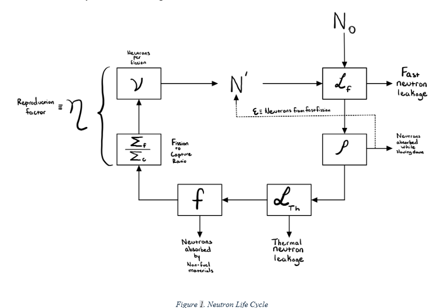
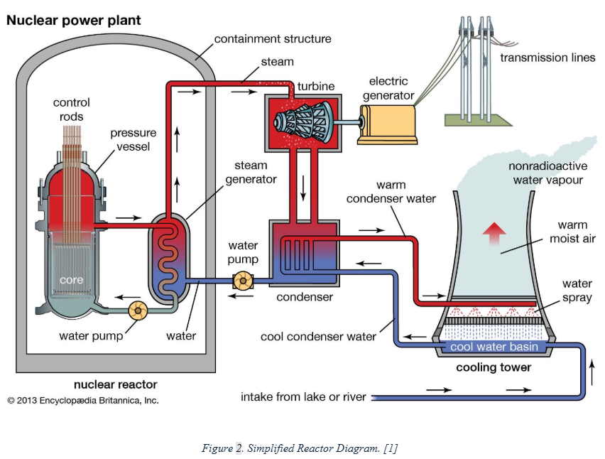
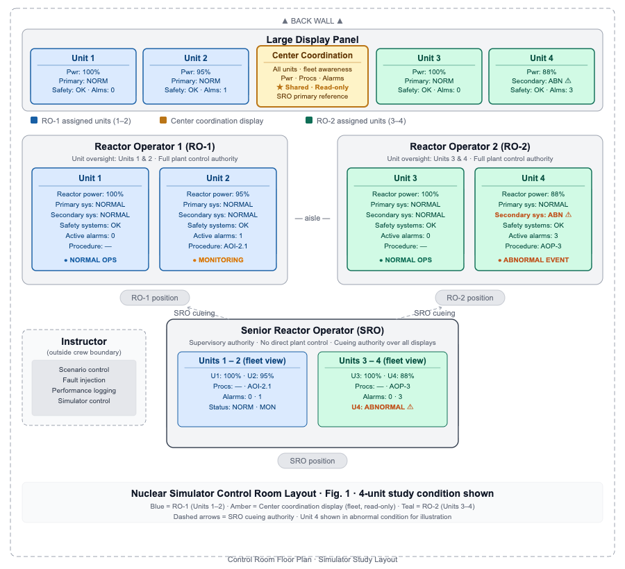
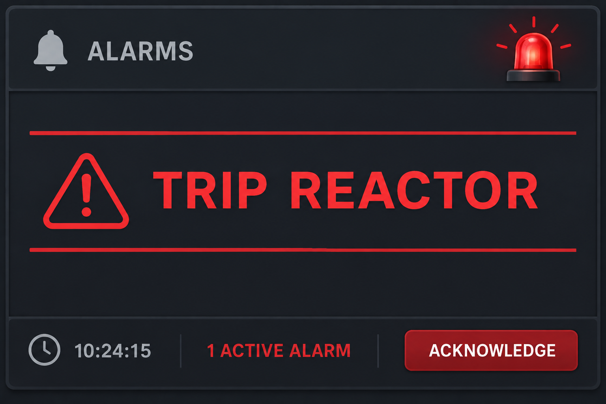

# **2. Integrated Plant Operations**

When operating, operators can tell you what the plant is going to do based on their actions and even tell you what is happening in a region they do not have explicit indication of based on the instrumentation available to them. This is possible because they can build a maintain a model of the plant in their head through their understanding of the fundamental relationships and their operational experience. This allows operators to predict plant conditions relatively accurately without explicitly doing any true math. 

Although this takes years of experience, a similar understanding can quickly be gained via arrow analysis of the basic equations which is closer to the relationship operators have in their head. 

## **2.1 Fundamentals**

### **2.1.1 Reactor Physics**

#### **2.1.1.1 Neutron Life Cycle and the Six-Factor Formula**

One of the terms that is unavoidable when discussing nuclear reactors is really a group of terms that relate to a common root, **criticality** (or just critical). A reactor is critical when the **number of neutrons in the succeeding generation is the same as the preceding generation**. This is shown in the neutron lifecycle, shown in Figure 1. 

The neutron lifecycle yields a relationship between No and N' that can be rearranged to produce the effective multiplication factor via what is known as the six-factor formula. The original formula can be seen in Equation 1 below, with the rearranged formula in Equation 2.

$$
N' = N_o \rho f \eta \epsilon \mathcal{L}_f \mathcal{L}_{th}
\tag{1}
$$

$$
k_{eff} =
\frac{N'}{N_o}
=
\rho f \eta \epsilon \mathcal{L}_f \mathcal{L}_{th}
\tag{2}
$$

Where:

| Symbol | Definition |
| --- | --- |
| $\rho$ | Resonance escape probability |
| $f$ | Thermal utilization factor |
| $\eta$ | Reproduction factor |
| $\epsilon$ | Fast fission factor |
| $\mathcal{L}_{th}$ | Thermal non-leakage factor |
| $\mathcal{L}_{f}$ | Fast non-leakage factor |
| $k_{eff}$ | Effective multiplication factor |

A reactor is **subcritical** when the number of neutrons in the succeeding generation (N') is less than the number of neutrons in the preceding generation (No). This would mean reactor power is going down over time. 

A reactor is **supercritical** when the number of neutrons in the succeeding generation (N') is greater than the number of neutrons in the preceding generation (No). This would mean reactor power is growing over time. There is a subset of supercritical that is important, known as prompt-supercritical, which means the reactor is critical off prompt neutrons alone. The importance of this will be discussed later. 

#### **2.1.1.2 Point Reactor Kinetics** 

There is a plethora of equations that can explain how reactor power changes in response to various changes; however, operators rarely do the actual math when operating, instead relying on relationships derived from knowledge of such equations and operating experience. The easiest of these equations to develop this relationship is the point **kinetics equation**, seen in Equation 3 below. 

$$
\frac{d}{dt}P(t)
=
\left(
\frac{\rho-\beta}{\Lambda}
\right)P(t)
+
\sum_{i=1}^{6}\lambda_i C_i(t)
\tag{3}
$$

Where:

| Symbol | Definition |
| --- | --- |
| $P(t)$ | Reactor power level |
| $\beta$ | Delayed neutron fraction |
| $\Lambda$ | Prompt neutron generation time |
| $\displaystyle \sum_{i=1}^{6} \lambda_i C_i(t)$ | Contribution of delayed neutrons to reactor power level |
| $\displaystyle \rho(t)=\frac{k_{eff}-1}{k_{eff}}\approx\delta k$ | Amount the reactor deviates from criticality |

There are several contributions to the reactor’s deviation from **criticality**, but they can largely be combined into temperature, shims, poisons and fuel. These can be seen below in Equation 4. 

$$
\delta k
=
\delta k_T
+
\delta k_{shim}
+
\delta k_{pois}
+
\delta k_{fuel}
\tag{4}
$$

Adapting Equation 4 to look at how these contributions change over time yields Equation 5. 

$$
\Delta \delta k
=
\Delta \delta k_T
+
\Delta \delta k_{shim}
+
\Delta \delta k_{pois}
+
\Delta \delta k_{fuel}
\tag{5}
$$

Two assumptions in this equation tease out a relationship that is **critical** to operations. The first can be seen assuming the reactor is observed instantaneously ($t \to 0$). In an instant, the concentration of both fuel and poisons can be assumed constant ($\Delta \delta k_{pois} = 0$ and $\Delta \delta k_{fuel}$)  The next is the assumption that the reactor was **initially** critical and, due to temperature feedback, will return to criticality ($\Delta \delta k = 0$). This results in the relationship visible in Equation 6. 

$$
-\Delta \delta k_T
=
\Delta \delta k_{shim}
\tag{6}
$$

This relationship conveys the principle that when the reactor is past the point of adding heat, changes in rod position will be compensated by changes in temperature. When rods are shimmed outward, increasing the reactivity in the reactor by removing negative reactivity from the rods. Reactor power rises in response, resulting in a rise in temperature within the reactor. This illustrates an important safety feature present in most reactor designs and all light water reactors known as **negative temperature feedback**. 

Negative temperature feedback is a self-regulating mechanism where the reactor's power output is stabilized by changes in temperature. As the reactor's temperature increases, the water moderator becomes less effective at slowing down neutrons due to reduced water density. This reduction in moderation decreases the likelihood of neutron capture by fissile nuclei, which in turn reduces the reactor's reactivity. Consequently, the power level decreases, and the reactor naturally stabilizes. 

Conversely, if the reactor temperature decreases, the moderator becomes more effective, increasing neutron moderation and reactivity, which leads to a rise in power. This dynamic relationship ensures that the reactor resists abrupt changes in power, contributing to its inherent safety and thermal stability. 

#### **2.1.1.3 The Effect of Delayed Neutrons**

Control of a nuclear reactor is possible because of the presence of delayed neutrons. The reactor period, or the time it takes for reactor to increase by a multiple of e (Euler’s number, or $\approx 2.7$), changes significantly with delayed neutrons and can be calculated using Equation 6 [^1]. 

$$
T = \frac{l}{(k - 1)}
\tag{6}
$$

Where:

| Symbol | Definition |
| --- | --- |
| $T$ | Reactor period (seconds) |
| $l$ | Neutron lifetime |
| $k$ | Multiplication factor |

Without delayed neutrons, neutron lifetime ($l$) is approximately $2∗10^−5 seconds. If we assume a 10 pcm reactivity insertion, making the multiplication factor (k) 1.0001, the reactor period would be 0.2 seconds. This means that every second reactor power would climb by $e^5$, or nearly 150 times the original power [^1]. When the reactor is supercritical from prompt neutrons alone, or prompt-supercritical, it can behave in this manner  .

By considering delayed neutrons, the effective neutron lifetime becomes approximately 0.085 seconds. With the same reactivity insertion, the reactor period would be 850 seconds or 14 minutes and 10 seconds. This is clearly much more controllable by permitting operator intervention and system response [^1]. 

### **2.1.2 System-Level Thermal Hydraulics**

The reactor generates heat that is transferred to the secondary via the SG, where a turbine converts that thermal energy to work in the form of electricity. The steam is then condensed in the condenser before returning to the steam generator. This process is shown in Figure 2 below[^2]. 

The **thermal power** of the reactor can be expressed via Equation 7. 

$$
\dot{Q}_{Rx}
=
\dot{m}_{Rx}\,c_{p,Rx}\left(T_H - T_C\right)
\tag {7}
$$

Equation 8 demonstrates how to calculate the thermal power of the steam generator, while Equation 10 is for calculating the thermal power of the secondary. At steady state with the feedwater control valves in automatic, these equations should be equal, meaning $\dot{Q}_{Rx} = \dot{Q}_{SQ} = \dot{Q}_{Sec}$. Equation 9 is a method to connect the $T_{AVG}$ to the hot and cold temperatures present in Equation 7. 

$$
\dot{Q}_{SG}
=
(UA)_{SG}
\left(T_{AVG} - T_{Stm}\right)
\tag{8}
$$

$$
T_{AVG}
=
\frac{T_H + T_C}{2}
\tag{9}
$$

$$
\dot{Q}_{Sec}
=
\dot{m}_{Sec}
\left(h_{Stm} - h_{Fw}\right)
\tag{10}
$$

Equation 10 can similarly be expressed as the sum of the thermal power rejected via the condenser and the work output of the turbine, as shown in Equation 11. 

$$
\dot{Q}_{Sec}
=
\dot{Q}_{COND} + \dot{W}_{Turb}
\tag{11}
$$

The heat rejected via the condensate can be calculated using Equation 12. At steady state, $\dot{Q}_{COND} = \dot{Q}_{Sink}$ the heat input to the sink calculated using Equation 13.

$$
\dot{Q}_{COND}
=
(UA)_{COND}
\left(
T_{COND} - T_{Sink,AVE}
\right)
\tag{12}
$$

$$
\dot{Q}_{Sink}
=
\dot{m}_{Sink} c_{p,Sink}
\left(
T_{Sink,out} - T_{Sink,in}
\right)
\tag{13}
$$

$$
T_{Sink,AVE}
=
\frac{
T_{Sink,in} + T_{Sink,out}
}{2}
\tag{14}
$$

[^1]: Point Kinetics equations: Definition & derivation. Nuclear Power. (2022, January 27). https://www.nuclear-power.com/nuclear-power/reactor-physics/reactor-dynamics/point-kinetics-equations/  

[^2]: Martin, W. nuclear power. Encyclopedia Britannica. (2026, July 18). https://www.britannica.com/technology/nuclear-power  

## **2.2 Operations**

This section provides an overview of the RANCOR simulation layout, including the primary interface elements, displays, and controls. You will learn how the simulation is organized, how to navigate the interface, where to locate important plant information, and how to interact with the controls used during reactor operations.

### **2.2.1 Simulation Layout**

The image below illustrates how the RANCOR simulation control room is organized and how responsibilities are divided among the operating crew.

{ width="700"}

Starting from the rear of the control room, the **Senior Reactor Operator (SRO)** is positioned where they can maintain an overall view of the operating crew and the status of all four reactor units. This allows the SRO to maintain situational awareness, coordinate activities between the Reactor Operators, and monitor overall plant conditions.

Two Reactor Operators are positioned in front of the SRO:

* **Reactor Operator 1 (RO-1)** is responsible for **Units 1 and 2** and has plant control authority for those assigned units.
* **Reactor Operator 2 (RO-2)** is responsible for **Units 3 and 4** and has plant control authority for those assigned units.

In front of the Reactor Operators are **five large display panels** that provide information about the four reactor units.

* The **two left displays** provide information associated with **RO-1 and Units 1 and 2**.
* The **two right displays** provide information associated with **RO-2 and Units 3 and 4**.
* The **center display** serves as the **Center Coordination display** and presents information from all four units simultaneously.

The Center Coordination display is particularly important for the SRO because it provides a centralized view of plant conditions across all four units. Rather than focusing on the detailed controls of an individual unit, the SRO can use this display to maintain awareness of the overall simulation, identify changing conditions, and coordinate the activities of both Reactor Operators.

This arrangement establishes a clear division of responsibility while still allowing the entire crew to maintain awareness of overall plant operation.

### **2.2.2 Instruments**

The diagram below shows a simple representation of a nuclear reactor. 

- The **light blue** box represents cold water entering the reactor 
- the **orange** box represents the reactor 
- The **red** box represents hot water moving from the reactor
- The **dark blue** box represents the coolant used to cool the hot water
- The **pink** box is the steam generator and we can see the water moving into it
- The **yellow** box is the turbine and receives water from the condenser and gains steam

To help explain the different elements of the simulation, the following sections will use a similar layout with the corresponding elements highlighted.

{ width="500" }

Similar to the diagram above, this diagram shows the corresponding elements within RANCOR. There is more information displayed here, so the interface may seem overwhelming at first. Using the colored boxes from the previous diagram can help identify the different elements.

Again, the **light blue** box represents the cool water leading into the reactor (**orange**). The hot water (**red**) then leads to the coolant (**dark blue**), down into the steam generator (**pink**), and finally to the turbine and condenser (**yellow**).

This diagram also introduces valves and pumps.

The color of a valve indicates its position:

- **Red**: The valve is closed
- **Green**: The valve is open
- **Partially red and partially green**: The valve is somewhere between fully open and fully closed

The red circles represent the pumps, which provide the driving force for water flow through the system.

Recognizing these colors and symbols will make it easier to understand what is happening within the RANCOR interface.

### **2.2.3 Controls**

#### **2.2.3.1 Starting Up RANCOR**

When opening RANCOR, a small control window will appear. This window can be easy to overlook, but it contains important controls for starting, pausing, restarting, and exiting the simulation.

The images below show the control window **before the simulation is started** and **while the simulation is running**.

##### **Run and Pause**

When RANCOR is first opened, the control window displays a **red "Run" button**. Selecting **Run** starts the simulation.

Before selecting **Run**, you can still view the controls, instruments, and other simulation elements; however, the simulation is not actively running, so you will not see how the plant responds over time.

Once **Run** is selected, the button changes to a **"Pause" button**. Selecting **Pause** temporarily stops the simulation. The button will then return to **Run**, allowing you to continue the simulation when you are ready.

*RANCOR control window displaying the **Run** button.*

*RANCOR control window displaying the **Pause** button.*

##### **Snap and Screenshot**

The **Snap** and **Screenshot** options are available for capturing images of the simulation.

##### **Exit**

The **Exit** button is located in the upper corner of the window. Selecting this button will shut down the simulation.

##### **Time and Messages**

At the bottom of the window, you can see the **simulation time** and a **message area**. These messages provide updates about the current state of the simulation, such as when the simulation is started, paused, or restarted.

Keeping this window visible while using RANCOR makes it easier to check whether the simulation is currently **running or paused** and provides quick access to the basic simulation controls.

#### **2.2.3.2 Running Simulation Controls**

Similar to the **Instrument** section, we will use the same simplified nuclear reactor diagram to help explain the different controls within RANCOR. The colored boxes represent different areas of the plant and will make it easier to connect each control to the system or component it affects.

{ width="500" }

* The **orange** box represents the **reactor**.
* The **purple** boxes represent the **pumps**.
* The **pink** box represents the **steam generator**.
* The **yellow** box represents the **turbine**.
* The **green** box represents the **valve control area**.

The following sections will use these colors to identify the corresponding controls within the RANCOR interface and explain what each control does.

This next image demonstrates what the controls look like within RANCOR. The colored boxes highlight the different control areas available to the operator.

- The **orange** boxes represent the **reactor controls**, where the operator can choose between automatic and manual control.
- The **purple** boxes represent the **pump controls**, where the operator can turn pumps on or off.
- The **pink** box represents the **steam generator controls**.
- The **yellow** box represents the **turbine controls**, where the operator can adjust the speed control, load control, and bypass.
- The **green** box represents the **valve control area**, which contains switches used to open and close various valves throughout the system.

Becoming familiar with the location of these controls will make it easier to navigate the RANCOR interface and identify which controls correspond to each part of the simulated plant.

### **2.2.4 Alarms**

Nuclear reactors use alarms to help operators maintain awareness of plant conditions. Although alarms may seem intimidating at first, they are an important tool for the operating crew. Alarms alert operators when a condition has changed or when something may require their attention.

By monitoring alarms, operators can quickly identify changing plant conditions, determine what is happening, and take the appropriate actions.

During a RANCOR simulation, you may encounter several different alarms. One important alarm you may see is **"Trip Reactor."**

The image below is a **training illustration** of a Trip Reactor alarm. It is intended to emphasize the alarm concept and does not represent exactly how the alarm appears within the RANCOR interface.

{ width="350" }

When an alarm occurs during the simulation, it is important to recognize the alarm, determine what caused it, and identify the appropriate response.

A **Trip Reactor** alarm may occur because of an operator action or a change in simulated plant conditions. When this happens, you may have a limited amount of time to recognize the condition and take the appropriate action. Pay attention to the plant indications and use the applicable procedures to determine what should be done next.

## **2.3 Conclusion**

The **Integrated Plant Operations** section introduced the main components of RANCOR, including plant systems, instruments, controls, and alarms. Understanding how these elements work together will help you navigate the simulation and better recognize how your actions affect plant conditions.
