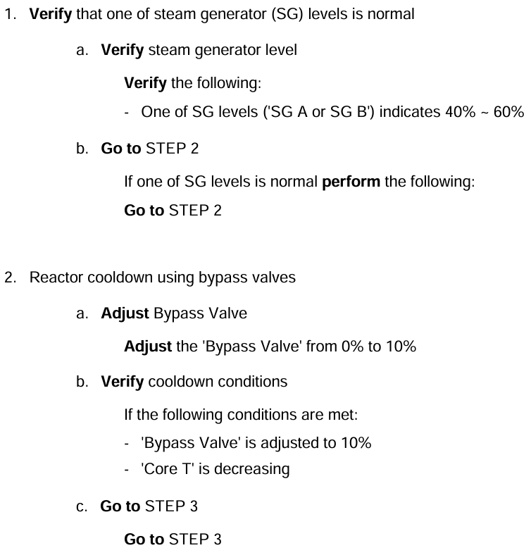
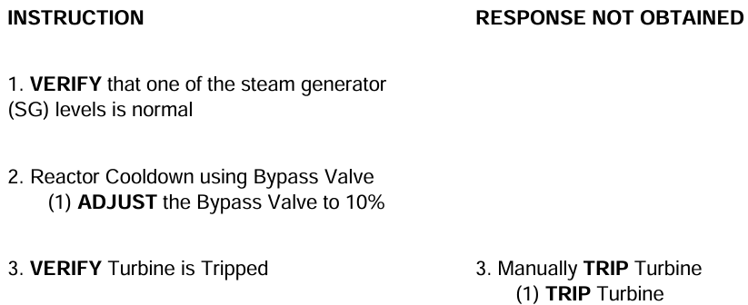

# 4. Plant Procedures

Nuclear power plant operators use written procedures to safely and consistently operate the plant. Procedures provide operators with step-by-step guidance for performing plant activities, responding to changing plant conditions, and taking appropriate actions when abnormal or emergency conditions occur.

Operating a nuclear reactor simulator such as RANCOR is no different. Procedures are an important part of the simulation because they help users understand what actions should be taken, when those actions should be taken, and what plant conditions should be monitored throughout an event.

Within RANCOR, it is important to understand both the **category** of a procedure and the **type** of procedure being used.

- **Procedure Category** describes the purpose of the procedure, such as an OP, AOP, or EOP.
- **Procedure Type** describes how the procedure is presented to and used by the operator, ranging from paper/PDF procedures to interactive digital procedures.

## 4.1 Procedure Categories

RANCOR uses three primary procedure categories: **Operating Procedures (OPs), Abnormal Operating Procedures (AOPs), and Emergency Operating Procedures (EOPs).**

Each category serves a different purpose depending on the condition of the simulated plant.

### 4.1.1 Operating Procedures (OP)

**Operating Procedures (OPs)** provide instructions for normal plant operations. These procedures guide operators through routine activities and help ensure that tasks are performed in a consistent and controlled manner.

Operating Procedures may be used for activities such as:

- Plant or system startup
- Plant or system shutdown
- Normal system operation
- Changing equipment or system configurations
- Routine operator actions
- Placing equipment into or out of service
- Monitoring normal plant conditions

In RANCOR, OPs help users become familiar with normal plant operation before progressing to more complex abnormal or emergency scenarios.

### 4.1.2 Abnormal Operating Procedures (AOP)

**Abnormal Operating Procedures (AOPs)** provide guidance when plant conditions have moved outside normal operation but have not necessarily developed into an emergency.

An abnormal condition may involve unexpected equipment behavior, changes in system parameters, instrument indications, alarms, or other conditions that require operator attention.

AOPs help operators identify the abnormal condition, determine the appropriate response, and take actions intended to return the plant to a normal or stable condition. Depending on the event, an AOP may also direct operators to another procedure if plant conditions continue to change.

Examples may include:

- Unexpected equipment malfunctions
- Loss or degradation of a supporting system
- Abnormal temperature, pressure, level, or flow
- Unexpected alarms or instrument indications
- Problems with pumps, valves, or other plant equipment

### 4.1.3 Emergency Operating Procedures (EOP)

**Emergency Operating Procedures (EOPs)** provide guidance for responding to serious plant conditions and accident scenarios. These procedures help operators take actions necessary to place the reactor and plant systems in a safe and stable condition.

During an emergency scenario, operators must evaluate plant indications, recognize changing conditions, and perform the actions directed by the applicable procedure.

Within RANCOR, EOP scenarios can help users practice interpreting plant conditions, responding to alarms, using instrumentation, manipulating controls, and understanding how operator actions affect the simulated plant.

## 4.2 How the Procedure Categories Connect

A useful way to think about the three categories is:

- **OP — Normal conditions:** Used to operate the plant and its systems during expected conditions.
- **AOP — Abnormal conditions:** Used when something is not operating as expected and operator action is required.
- **EOP — Emergency conditions:** Used during serious events when operators must respond to protect the reactor and maintain or restore safe plant conditions.

As you work through RANCOR scenarios, pay attention not only to the actions listed in a procedure, but also to the **plant indications, alarms, and conditions that caused the procedure to be entered**.

Understanding why a procedure is being used is an important part of understanding how the simulated plant operates.

## 4.3 Procedure Types

In addition to procedure categories, RANCOR procedures can be separated into **three types** based on how procedural information is presented to the operator.

The three types represent a progression from traditional paper procedures toward interactive digital procedures:

**Type 1 → Type 2 → Type 3**

**Paper/PDF → Digital → Interactive Digital**

### 4.3.1 Type 1 — Paper/PDF Procedures

**Type 1 procedures** are traditional paper-style procedures provided as PDF documents. The operator manually reads and navigates through the procedure while completing the required actions.

This is an example of a paper procedure for a reactor shutdown:

When using a Type 1 procedure, users should become familiar with items such as:

- Procedure titles and numbers
- Prerequisites and initial conditions
- Individual procedure steps
- Cautions, warnings, and notes
- References to other procedures
- Conditional or branching instructions
- Required plant indications and parameters

Type 1 procedures may require users to move between pages, sections, or referenced procedures as plant conditions change.

### 4.3.2 Type 2 — Digital Procedures

**Type 2 procedures** fall between Type 1 and Type 3 but are closer to the Type 3 digital format.

Unlike Type 1 procedures, which are traditional paper/PDF documents, Type 2 procedures present procedural information in a more organized digital format. However, they do not provide the same level of interaction as a fully interactive Type 3 procedure.

Type 2 procedures provide a transition between traditional procedures and fully interactive digital procedures.

### 4.3.3 Type 3 — Interactive Digital Procedures

**Type 3 procedures** are interactive digital procedures. Rather than simply presenting a digital version of a document, these procedures allow the operator to interact with procedural information through the digital interface.

This is an example of a digital procedure for shutting down the reactor in an expedient way:

The goal of the Type 3 format is to provide procedural information in a **consistent, organized, and easy-to-navigate layout**.

Interactive digital procedures can help users:

- Identify the current procedure and step
- Navigate between procedure sections
- View information in a consistent format
- Locate cautions, warnings, and notes
- Follow conditional or branching steps
- Access supporting information

## 4.4 Understanding Procedure Categories and Types

Procedure **categories** and procedure **types** describe two different characteristics.

| Procedure Category | Purpose |
| --- | --- |
| **OP** | Normal plant operations |
| **AOP** | Abnormal plant conditions |
| **EOP** | Emergency plant conditions |

| Procedure Type | Format |
| --- | --- |
| **Type 1** | Traditional paper/PDF procedure |
| **Type 2** | Digital procedure with limited interactivity |
| **Type 3** | Interactive digital procedure |

A procedure can therefore have both a **category** and a **type**.

For example, a procedure could be an **OP Type 1**. In this case, **OP** identifies its purpose as an Operating Procedure, while **Type 1** identifies its format as a paper/PDF procedure.

## 4.5 Procedure Examples

The following examples demonstrate how procedures are used during RANCOR operation. These examples connect the procedure concepts discussed above with actions performed in the simulation. Each example will also include a video demonstration so you can see how the procedure is followed within RANCOR.

### 4.5.1 Startup

The **Startup Procedure** guides the operator through bringing the reactor from a shutdown condition to an operating condition.

At the beginning of the procedure, the reactor is shut down and several alarms may be active. This can make the simulation appear overwhelming at first. As you progress through the procedure and the reactor begins to come online, plant conditions will change and alarms will gradually clear.

Pay attention to how the procedure guides the operator through these changing conditions. The video below provides an example of completing the Startup Procedure in RANCOR.

**Startup Procedure Video Example**

[Insert video here]

### 4.5.2 Rapid Shutdown

The **Rapid Shutdown Procedure** guides the operator through shutting down the reactor in an expedient and organized manner.

Unlike the Startup Procedure, where the reactor is gradually brought online, this procedure focuses on taking the reactor from an operating condition toward shutdown. As you progress through the procedure, pay attention to how the plant conditions, instruments, controls, and alarms change in response to the actions being performed.

The video below provides an example of completing the Rapid Shutdown Procedure in RANCOR and demonstrates how the procedure guides the operator through the shutdown process.

**Rapid Shutdown Procedure Video Example**

[Insert video here]